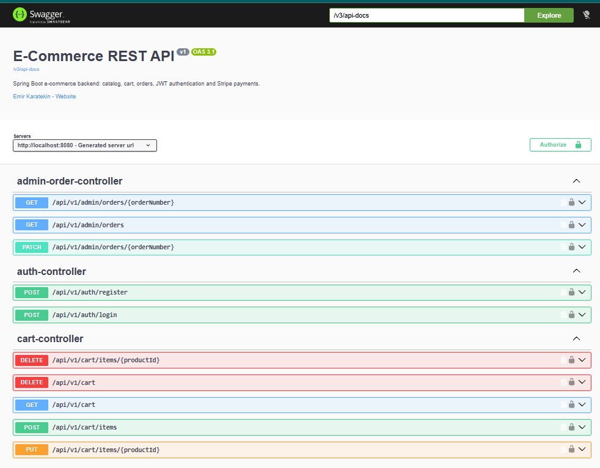
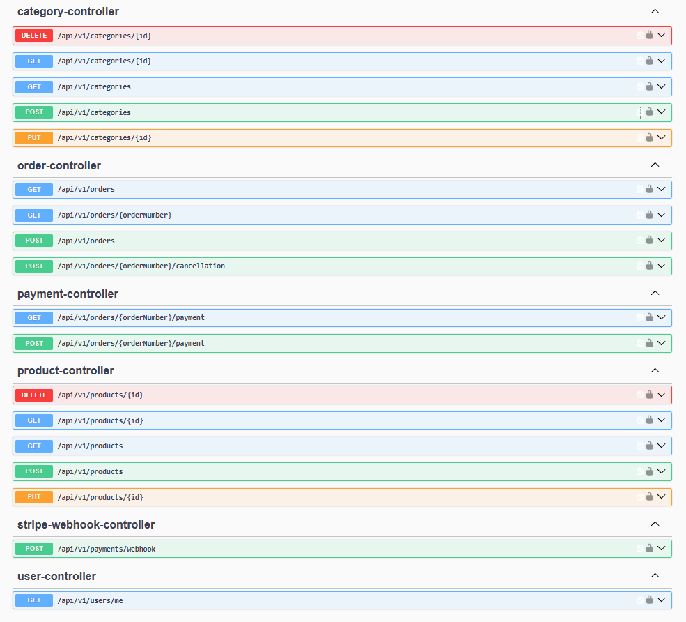

# Spring E-Commerce Backend

A production-style e-commerce REST API built with **Java 21**, **Spring Boot 4**, **PostgreSQL** and **Stripe**.
It covers the full purchase flow: catalog, cart, orders with safe stock handling, JWT authentication and card payments confirmed by signed webhooks.



<details>
<summary>More endpoints</summary>



</details>

## Tech stack

| Area | Technology |
|---|---|
| Language / framework | Java 21, Spring Boot 4.1 (Web MVC, Data JPA, Security 7, Validation) |
| Database | PostgreSQL 17 (Docker), Flyway migrations, Hibernate in `validate` mode |
| Security | Stateless JWT (HS512), BCrypt, role-based access (`USER`, `ADMIN`) |
| Payments | Stripe PaymentIntents, signed webhooks, idempotency keys, automatic refunds |
| Docs | OpenAPI 3.1 / Swagger UI (springdoc) |
| Tests | JUnit 5, Mockito, MockMvc, Testcontainers (real PostgreSQL) |

## Highlights

- **Layered architecture:** controllers only handle HTTP; all business rules live in services; entities never leave the service layer (request/response DTOs).
- **Consistent errors:** one `@RestControllerAdvice` returns the same JSON shape for validation, 401/403 (including errors raised inside security filters), 404, 409 and 502.
- **Stock safety under concurrency:** placing an order locks the product rows (`SELECT ... FOR UPDATE`, ordered by ID to avoid deadlocks, 3 s lock timeout). Two customers buying the last item at the same moment get exactly one success and one clear "insufficient stock" error.
- **All-or-nothing checkout:** stock check, price snapshot, stock decrement, order creation and cart clearing run in a single transaction.
- **Order state machine:** `PENDING → PAID → SHIPPED → DELIVERED`, `PENDING → CANCELLED`. Only a verified Stripe webhook can mark an order as `PAID`.
- **Payment robustness:** idempotent payment start, duplicate-safe webhook handling, external calls made after DB commit, automatic refund if money arrives for an order that was cancelled in the meantime.
- **Stock reservation with expiry:** unpaid orders are cancelled automatically after 30 minutes and their stock is released.
- **Security details:** no IDOR (cart and orders are always resolved from the authenticated user), 404 instead of 403 for other users' orders, identical message for wrong email or password, secrets only via environment variables.

## Running locally

Requirements: JDK 21, Docker.

```bash
# 1. Start PostgreSQL
docker compose up -d

# 2. Provide Stripe test keys (never commit them)
#    Create config/application-local.yaml (git-ignored):
#      stripe:
#        secret-key: sk_test_...
#        webhook-secret: whsec_...

# 3. Run the application (Flyway creates the schema on first start)
./mvnw spring-boot:run
```

- Swagger UI: http://localhost:8080/swagger-ui.html (log in via `/api/v1/auth/login`, then click **Authorize**)
- Default admin (development only): `admin@ecommerce.local` / `Admin12345`, override with `ADMIN_EMAIL` / `ADMIN_PASSWORD`

To receive Stripe webhooks locally:

```bash
stripe listen --forward-to localhost:8080/api/v1/payments/webhook
```

### Configuration (environment variables)

| Variable | Purpose |
|---|---|
| `DB_URL`, `DB_USERNAME`, `DB_PASSWORD` | PostgreSQL connection |
| `JWT_SECRET` | Base64-encoded HMAC key (at least 256 bits) |
| `JWT_EXPIRATION` | Token lifetime, e.g. `1h` |
| `STRIPE_SECRET_KEY`, `STRIPE_WEBHOOK_SECRET` | Stripe credentials |
| `SPRING_PROFILES_ACTIVE` | Defaults to `local` |

## API overview

| Area | Endpoints |
|---|---|
| Auth | `POST /api/v1/auth/register`, `POST /api/v1/auth/login`, `GET /api/v1/users/me` |
| Catalog (public read, admin write) | `/api/v1/categories`, `/api/v1/products?categoryId=&keyword=&page=&size=&sort=` |
| Cart | `GET/DELETE /api/v1/cart`, `POST /api/v1/cart/items`, `PUT/DELETE /api/v1/cart/items/{productId}` |
| Orders | `POST/GET /api/v1/orders`, `GET /api/v1/orders/{orderNumber}`, `POST /api/v1/orders/{orderNumber}/cancellation` |
| Payments | `POST/GET /api/v1/orders/{orderNumber}/payment`, `POST /api/v1/payments/webhook` (Stripe) |
| Admin | `GET /api/v1/admin/orders?status=`, `GET/PATCH /api/v1/admin/orders/{orderNumber}` |

## Tests

```bash
./mvnw test
```

Integration tests start a throw-away PostgreSQL with Testcontainers (Docker required), apply the Flyway migrations and exercise the API through MockMvc, with the payment provider mocked.
